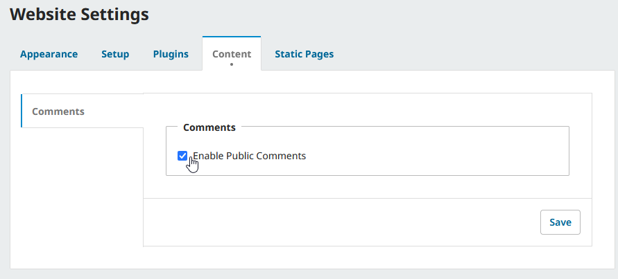
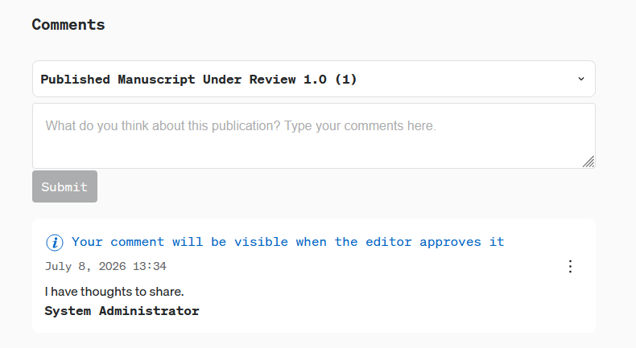
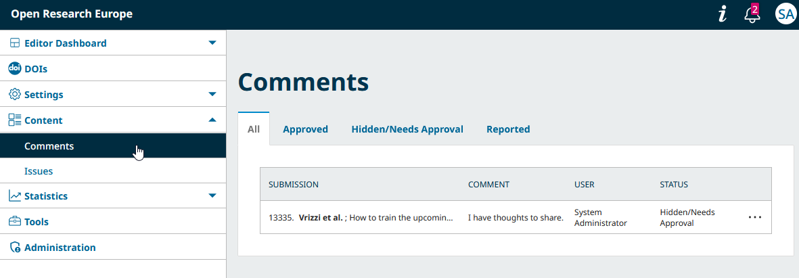
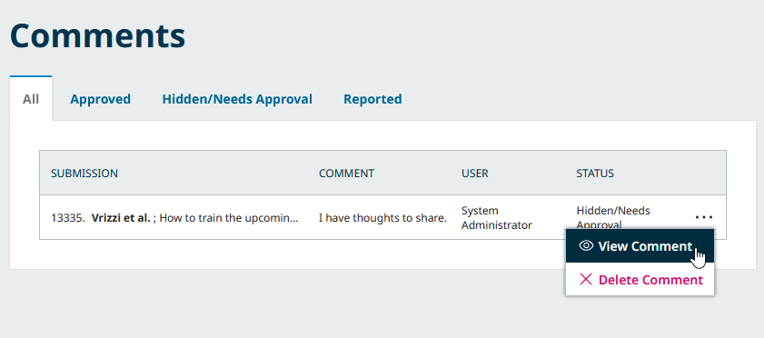
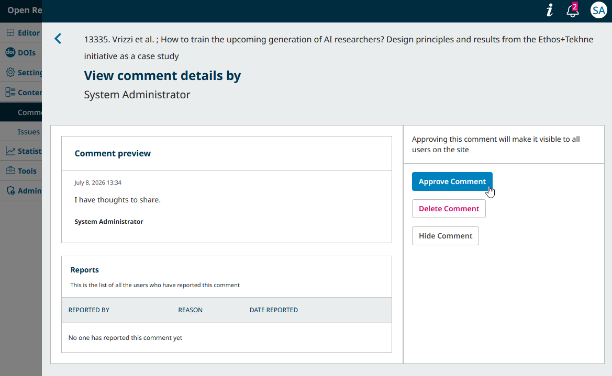
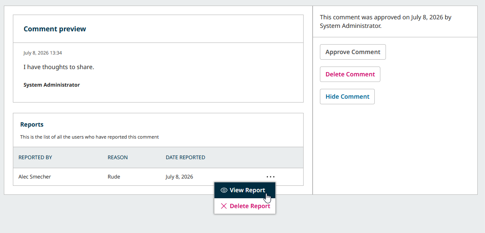

# Configure and Moderate Public Commenting {#commenting}

In OJS 3.6, the option to enable and moderate public comments on articles was added. Comments are already enabled on the ORE platform, but can be disabled if needed.

To enable or disable commenting, visit the Content tab under Website Settings from the left sidebar. From here, check or uncheck the box next to Enable Public Comments and click “Save”.

Disabling this option will hide all existing comment sections from view.

## How does commenting work in OJS?

To ensure the safety of your journal and all participants, OJS implements a few restrictions for commenting.
- Comments are **never** published without approval by a journal manager or editor.
- Anonymous comments are never allowed.
- Comments never include file attachments, images, or any type of rich text formatting.
- Problematic comments can be reported at any time by anyone with a user account.
- If a new version of an article is posted, a new comment section will be created for the new version, and the comment section of any and all previous versions will be closed.

## Approving and moderating comments

Any comments made by users, including users with high level permissions like Site Administrator or Journal Manager, are sent to a moderation queue before being published.

To manage comments in the moderation queue, navigate to Content in the left sidebar and select “Comments”.

The comment moderation queue has 4 views that allow you to filter comments depending on their status: All, Approved, Hidden/Needs Approval, and Reported.

To approve a comment marked with the “Hidden/Needs Approval Status”, click the more options (three dots) icon next to the comment.

You can choose to instantly delete the comment using “Delete comment”, or select “View comment” to access other options.

In addition to the comment and details of the commenter, you can also find any past or unresolved reports made about the comment. If you wish to approve the comment, select “Approve comment”. Even after approving a comment, you can always return to this screen to delete or hide it.
You or the original commenter can also delete comments from the public comment section at any time by clicking the more options (three dots) icon next to the comment under the article and selecting “Delete”.

## Moderating reported comments
Once approved, comments may be reported by other users. You can find all comments that have been reported in the Reported tab. Reported comments will remain visible, but you may decide to hide or delete them after reviewing the report.
Select “View comment” from the more options icon to review the report and reason, and take any moderation action as needed.

