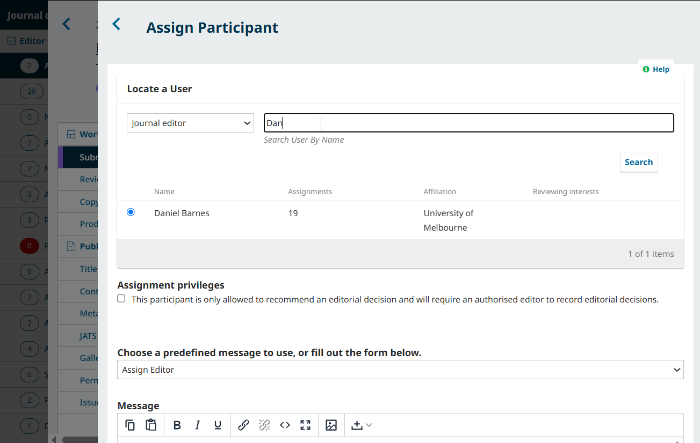
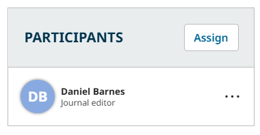
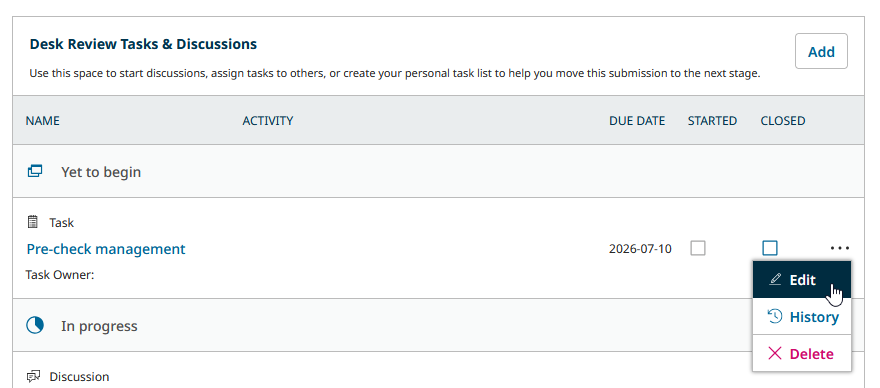
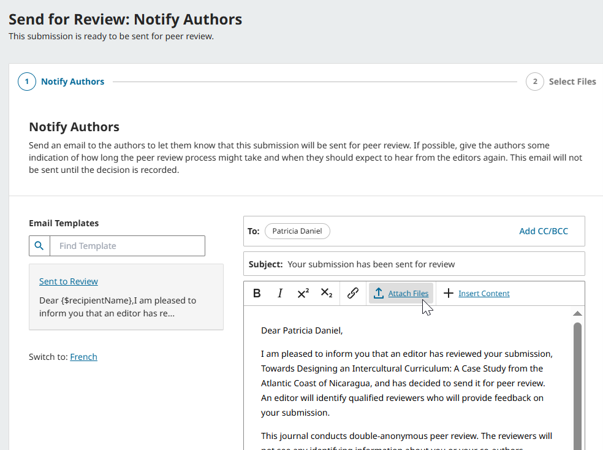
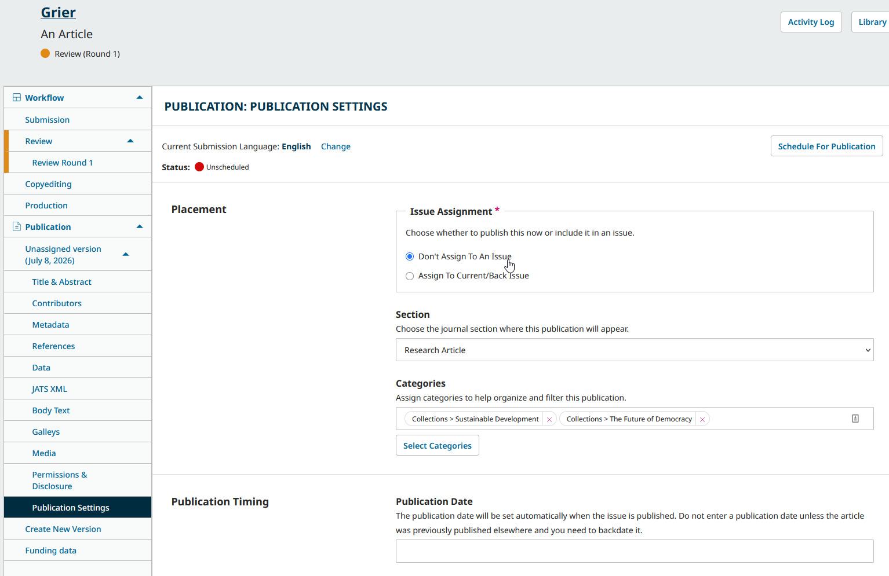
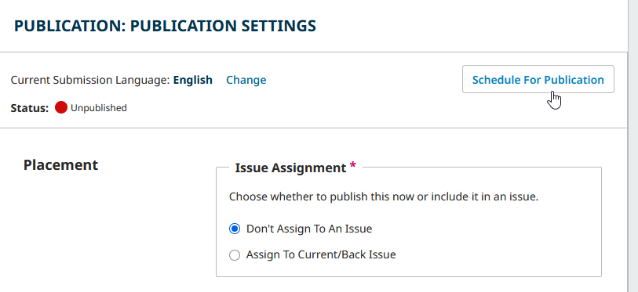

# Receiving Submissions: Prepublication Checks & Initial Publication

The first stage of the Editorial Workflow is the Submission stage. New submissions land in this stage, where they are assigned to Section Editors (automatically or manually by a Journal Editor or Journal Manager). The Editor will be able to record an editorial decision or choose to move into the Review stage. 

In this chapter, we will explain:
* [How an Editor is notified and assigned to a submission](#manage-assignment)
* [How to manually assign an Editor](#assign-editor)
* [How to complete ORE prepublication checks](#prepub-checks)
* [How to move the submission to peer review](#reject-or-review)
* [How to publish submissions as manuscripts under review](#publish)

The roles involved in this stage are typically: Editors (Journal Editors and Section Editors) and Authors.

## Manage New Submission Notifications and Automatic Assignments {#manage-assignment}

When an author makes a new submission, Editor(s) will be automatically emailed a notification and informed via their Tasks menu. 

>  Automatic assignments and notifications about a new submission are reliant on the journal settings selected by the Journal Manager. 
>
> * If there is only one user appointed to an Editor or Journal Manager role, that user will be automatically assigned and notified. 
> * If one or more Editors are [assigned to the section](https://docs.pkp.sfu.ca/learning-ojs/journal-managers/en/policies.md#edit-section) the submission was made in, they will be automatically assigned to the submission and notified.
> * If one or more Editors are [assigned to a category](https://docs.pkp.sfu.ca/learning-ojs/journal-managers/en/policies.md#categories) the submission was made in, they will be automatically assigned to the submission and notified.
> * Additional contacts for new submission notifications can be customized from Settings > Workflow > Emails. See [Configure Email Settings in Learning OJS for Journal Managers](https://docs.pkp.sfu.ca/learning-ojs/journal-managers/en/communications.md#email-config) for more details.

You can change your personal notification settings by clicking the user menu from the top right and accessing Edit Profile > Notifications.

## Manually Assign an Editor to a Submission {#assign-editor}

Depending on the configurations described above, some new submissions may come in unassigned. In this case, the next step is to assign an Editor. You can assign yourself or another user with an Editor role.

Select the _Assign_ link in the **Participants** panel.

Search for an individual by name or view all individuals in a given role by choosing the relevant role and pressing the Search button. You will see the number of submissions already assigned to each individual to help you track their editorial workload and plan accordingly.
Choose whether the assignee should be able to finalize an editorial decision, or simply recommend an editorial decision.
Choose whether the assignee should have permission to edit publication details.
Choose an email template from the dropdown to inform the assignee about their new assignment, or draft a custom email message. 

Hit the **OK** button to make the assignment and send the message.

The selected Editor will now be added to the Participants list.

> Note that a Pre-Review Discussion has been automatically created as part of the assignment.

## Perform Prepublication Checks {#prepub-checks}

Tasks essential to the ORE workflow are automatically assigned at each stage of the workflow. During the submission stage, you will see the pre-check management task is already available.

Click the three dot icon to expand the options menu and select edit. Assign yourself or the editor responsible for completing the check as a participant, and mark them as responsible for the task. Edit the due date as necessary.

The assignee can view the details of the task by clicking the task name. Messages and files can be added to the task as described in the [Tasks and Discussions section of the Editorial Dashboard](./dashboard#tasks-discussions)]. 

## Reject or Prepare for Review {#reject-or-review}

After completing any pre-check management tasks, the assigned editor can make an initial decision.

**Send to Review**: If the assigned Editor is satisfied that the submission is appropriate for the journal and in need of peer review, they can select this option to move the submission to the next stage, Review. 

After reviewing the notification to be sent to the author and attaching any relevant files, make sure that all files relevant to peer reviewers are checked off before clicking OK.

Once the editor has selected an action, the submission status will change and the action buttons will be disabled.

If more discussion is needed to make a decision, for example between the assigned editor and Journal Editor or the assigned editor and the author, the Pre-Review Discussions panel can be used to communicate.

**Accept and Skip Review**: Skips the Review Stage and moves the submission directly into Copyediting. This can be useful for certain types of content that don’t require peer review. 
**Decline Submission**: Rejects the submission before going through the review process. The submission would then be archived. This decision can be reverted by clicking **Revert Decline**. After a declined decision is reverted, the submission is restored to its previous stage and review round if active.

## Publish Accepted Submissions as Published Manuscript Under Review {#publish}

As part of the publish, review, curate model, you will now publish the manuscript while it undergoes review.

Click “Publication” to expand the Publication menu. You will want to review the publication’s metadata and upload a galley file using the other items under the Publication menu. 
* [Learn about galley formats and how to upload them](https://docs.pkp.sfu.ca/learning-ojs/editorial-workflow/en/production#what-galleys-formats-can-ojs-accept)
* [Learn about the other fields in the Publication menu](https://docs.pkp.sfu.ca/learning-ojs/editorial-workflow/en/production#finalize-details) 

When you have reviewed the submission’s metadata and added a galley for the manuscript, move to Publication Settings.

On the Publication Settings page:
Select “Don’t Assign to An Issue” under Issue Assignment
Verify that the appropriate section is selected under Section
Use “Select Categories” to select all appropriate categories.
Click “Save”.

When you are ready to post the manuscript, click “Schedule for Publication”.

This will open the Review Publishing details window. Open the Publication Stage dropdown and select “Published Manuscript Under Review (PMUR)”.

Click “Confirm”, then review the confirmation message that appears before clicking “Publish”. This will publish an unreviewed version of the manuscript to the ORE site that can later be updated once it has been refereed.

