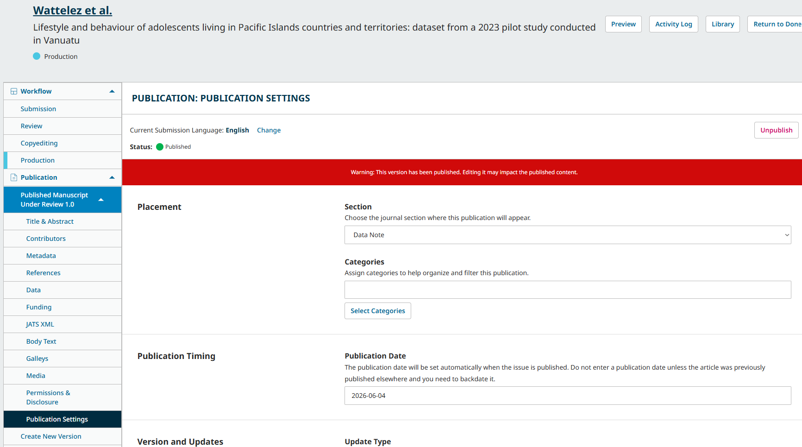
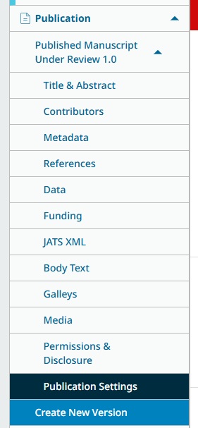
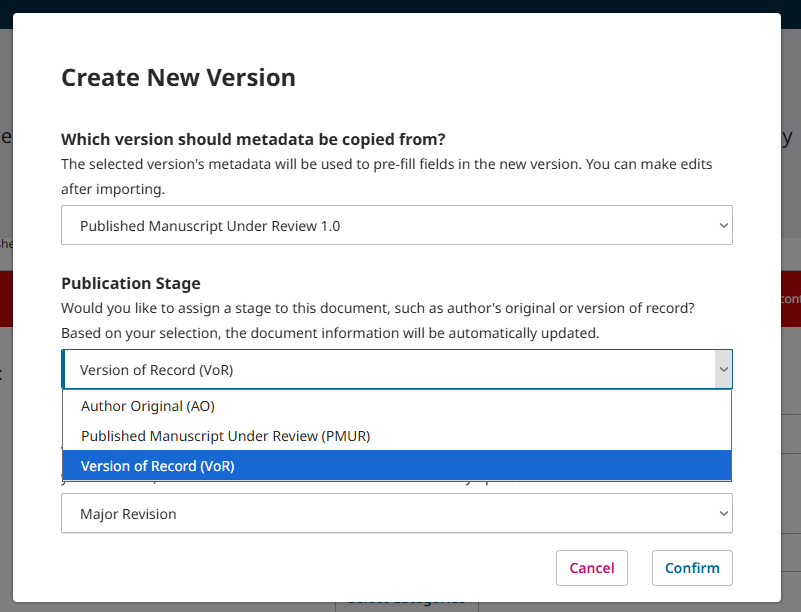

# Publication & Post-Publication: Publishing Manuscripts {#publication}

After the submission has gone through all four stages in the workflow, the version of record is ready to be published.

## Finalize Scheduled Article Details {#finalize-details}

You may first wish to confirm/edit information related to the manuscript, such as the section, associated category, publication date, article cover image, and more. Open the Publication menu and review each item under “Published Manuscript for Review 1.0”.

Pay special attention to the “Publication Settings” tab, and ensure that the section and categories have been correctly selected.

Click Save to record any changes.

## Create the Version of Record {#create-vor}

Once you have reviewed the manuscript details, click the “Create New Version” button at the end of the Publication menu. 

This will open the slide-out New Version window.

**Version to copy metadata from**: Select the same version you just used for your review of metadata and other details.
**Publication Stage**: Select “Version of Record”.
**Version Significance**: Select “Major Revision”.
Click “Confirm”.

The version of record has now been created and published. 
